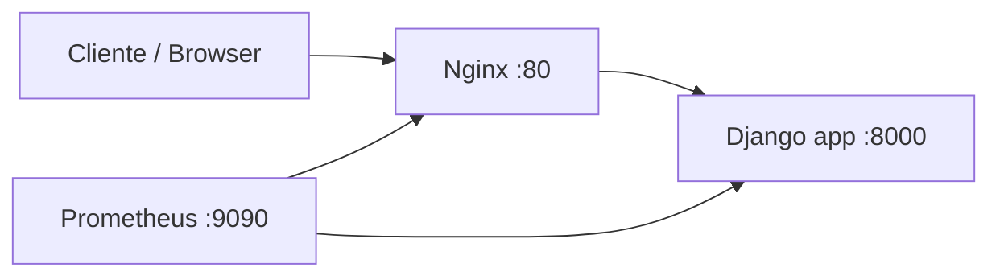

# Codeflix Catalog API Python

API Python do catálogo Codeflix, organizada em torno de domínio e casos de uso. O projeto está em estágio inicial e agora usa Django como base HTTP para facilitar integrações futuras.

## Tecnologias

- Python 3.12
- Django
- Gunicorn
- Docker e Docker Compose
- Nginx como proxy reverso
- Prometheus para coleta de métricas
- `unittest` para testes automatizados

## Arquitetura

A estrutura segue uma separação inspirada em Clean Architecture/DDD:

```text
src/
  common/
    domain/
  category/
    domain/
    application/
    infra/
  cast-member/
  genre/
  videos/
```

O domínio implementado no momento é `Category`, com pastas reservadas para aplicação e infraestrutura. O projeto Django fica em `src/config` e o comando principal fica em `manage.py`.

## Endpoints

| Método | Rota | Descrição |
| --- | --- | --- |
| `GET` | `/` | Status básico da API |
| `GET` | `/health` | Healthcheck usado pelo Docker |
| `GET` | `/metrics` | Métricas coletadas pelo Prometheus |

## Docker

Copie o arquivo de exemplo de variáveis, se quiser customizar portas:

```bash
cp .env.example .env
```

Suba todos os serviços:

```bash
docker compose up --build
```

Serviços disponíveis:

- API direta: <http://localhost:8000>
- API via Nginx: <http://localhost:8080>
- Prometheus: <http://localhost:9090>

O `docker-compose.yaml` define a rede compartilhada `codeflix`, onde:

- `nginx` acessa a API pelo host interno `app:8000`.
- `prometheus` coleta métricas em `app:8000/metrics`.
- `prometheus` também valida o caminho via proxy em `nginx:80/metrics`.

Em desenvolvimento, o `docker-compose.override.yaml` monta o código local dentro do container e usa `python manage.py runserver`.

### Stack Elastic opcional

O Compose também inclui um profile opcional para Elasticsearch, Kibana, APM Server, Heartbeat e Metricbeat. Ele não sobe por padrão.

```bash
docker compose --profile elastic up --build
```

Serviços adicionais:

- Elasticsearch: <http://localhost:9200>
- Kibana: <http://localhost:5601>
- APM Server: <http://localhost:8200>

O Heartbeat verifica `app:8000/health` e `http://nginx/nginx-health`. O Metricbeat lê métricas do Docker e do Prometheus.

## Comandos úteis

Rodar a API localmente sem Docker:

```bash
python3 -m venv .venv
source .venv/bin/activate
pip install -r requirements.txt
PYTHONPATH=src python manage.py runserver 0.0.0.0:8000
```

Rodar testes:

```bash
python3 -m unittest discover -s tests -p 'test*.py'
```

Validar configuração do Compose:

```bash
docker compose config
```

Ver logs dos serviços:

```bash
docker compose logs -f app nginx prometheus
```

## Fluxo dos containers



## Dev Container

A pasta `.devcontainer` permite abrir o projeto em um container pelo VS Code/Cursor. Ela reutiliza o Compose principal, conecta no serviço `app` e encaminha as portas `8000`, `8080` e `9090`.
